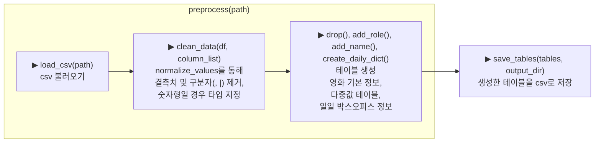

# 코드 설명

## 00_dataCheck.py

### 목적

- 데이터 전처리를 위해 원본 csv를 확인
- 다중값이 포함된 칼럼을 확인하고 데이터베이스 구조 설계

### 주요 모듈 및 매서드

- isnull().sum()                 : 결측치 확인
- info()                         : 결측치 및 타입 확인
- nunique()                      : 고유값 확인
- len(values) - values.nunique() : 중복값 확인

### 실행결과 및 계획

- 다중값으로 묶여있어 고유값과 중복값을 확인하기 어려움.
  - 장르의 경우에만, 고유값이 낮고 중복값이 낮아 유의미한 결과를 얻음.
- 다중값이 포함된 칼럼을 정규화 진행
  - 감독&배우, 배급사, 제작사, 장르별 테이블 구분
  - 감독과 배우는 한 테이블(people)로 병합하고 역할(role)과 코드값(people_code) 부여.
    - 코드, 이름을 포함한 엔티티 테이블 추가 생성
    - 감독과 배우가 같을 경우, 동명이인이 있을 경우를 대비

---

## 01_preprocess.py

### 목적

- 결측치 및 데이터베이스 생성을 위한 데이터 전처리

### 로직

